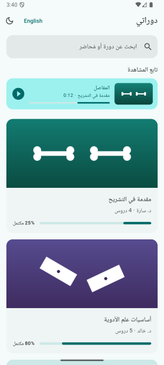
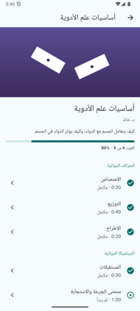
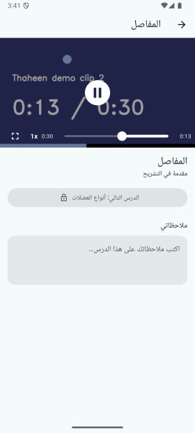
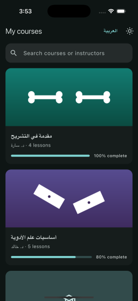
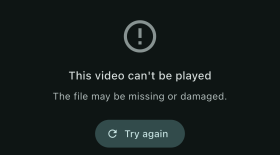

# Thaheen: Mini Offline LMS

An Arabic-first student app built for the Thaheen Flutter screening task. You browse courses, open a course, and watch lessons one by one. Progress, notes and settings survive app restarts. Everything is bundled, and there are no network calls.

| Courses (AR) | Course details (AR) | Player (AR) | English + dark | Broken video |
|---|---|---|---|---|
|  |  |  |  |  |

## How to run

Flutter 3.47 (stable) / Dart 3.13.

```bash
flutter pub get
flutter run            # Android or iOS device/simulator
flutter test           # 36 unit + widget tests
flutter build apk --release
```

The demo videos and thumbnails are committed. `python3 tool/generate_demo_media.py` regenerates them (needs `opencv-python`).

## Features

**Required.** Every item is implemented:
- **Courses list:** thumbnail, title, instructor, lesson count and progress %, plus a "Continue watching" card for the most recent unfinished lesson.
- **Course details:** sections and lessons with durations, a not started / in progress / completed status per lesson, and sequential unlock. Tapping a locked lesson shows a friendly message.
- **Player:**
  - play/pause, a seek bar, current time and duration, and speed 1x / 1.25x / 1.5x / 2x
  - fullscreen: the button or rotating the phone
  - resumes from the last position
  - auto-completes at 90%, and "Next lesson" respects the unlock rule
- **Persistence:** positions, completion, notes, theme, language and the last speed all survive a restart.
- **Arabic-first RTL UI** with the bundled Tajawal font (Arabic + Latin), and loading, empty and error states throughout, with no red screens.

**Bonus:** dark mode, an Arabic/English switch, course search, per-lesson notes, remembered playback speed and widget tests.

## Architecture

```
lib/
  core/          theme, localization (ARB), router, formatters, loading/empty/error views
  domain/        plain Dart models + ProgressRules (all learning rules, no Flutter)
  data/          repositories: bundled JSON catalog, SharedPreferences storage
  presentation/  one folder per screen: cubit(s) + widgets
```

Dependencies point one way: `presentation → data → domain`. I kept it deliberately lean.
- **No use-case classes.** With one repository per concern, they would only forward calls.
- **The real logic is one pure class,** `domain/progress_rules.dart`. It covers the 90% rule, unlock, course %, resume, continue-watching and next lesson, and it's the most heavily tested part.
- **DI** is plain `RepositoryProvider`. Repositories are created once in `main.dart`, with no service locator.
- **Logging:** `AppBlocObserver` (`core/bloc/`) prints each cubit's lifecycle and state changes in debug builds. Cubits report failures with `addError`, so every error is logged in one place.
- **Widgets are stateless,** one public widget per file. Screen state lives in the cubits, including player UI state (fullscreen, control visibility, the seek-bar drag position). Derived data like course %, lesson status and lock state comes from getters on `CoursesState`, so widgets only render.

### State management: Cubit (flutter_bloc)

| Cubit | Scope | Responsibility |
|---|---|---|
| `SettingsCubit` | app | theme mode + language |
| `CoursesCubit` | app | catalog (loading / loaded / failure), saved progress, search query |
| `PlayerCubit` | one lesson | video lifecycle, speed, 90% completion, saving progress, fullscreen, on-screen controls |
| `NotesCubit` | one lesson | the lesson note, saved after typing stops |

- **Why Cubit:** the state changes are simple and explicit. A Cubit is easy to read and easy to test without the extra event classes Bloc would add.
- **How screens stay in sync:** the player saves through `ProgressRepository`, which exposes a `changes` stream. `CoursesCubit` listens to it, so the list and details update as soon as a lesson completes, and cubits never call each other.
- **Playback position** changes about 10 times per second. The seek bar reads it straight from the `VideoPlayerController` (`ValueListenableBuilder`), and the cubit only emits coarse changes, so the whole screen doesn't rebuild on every tick.

### Local storage: SharedPreferences

- **Why it fits:** the data is tiny key-value data (a few dozen lessons), and the package is maintained by the Flutter team. It needs no code generation or adapters, and reads are synchronous after startup.
- **Layout:** progress is one versioned JSON map (`progress.v1`), and notes and settings are single keys.
- **Corrupt data:** if stored data is corrupt, the app starts fresh instead of crashing.
- **When to switch:** Hive/Isar/sqflite would pay off with hundreds of records or real queries. The repositories are the only code that would change.

## Learning rules

- **Completion:** position ≥ 90% of the *real* video duration (reported by the decoder, not `durationSec`). Once a lesson is completed it stays completed, even if it's rewatched.
- **Unlock:** the first lesson is open. Every other lesson needs the previous lesson in watch order completed, including across section boundaries.
- **Course progress** = completed lessons ÷ all lessons. An empty course is 0%, not NaN.
- **Resume:** playback starts at the last saved position, or at 0 if the student was within the last 3 seconds.
- **When progress is saved:**
  - every 5 s of playback
  - when playback pauses (including when the app goes to the background, because the player auto-pauses)
  - when leaving the lesson
  - immediately when a lesson completes

## Data shape

I kept the suggested shape and added an optional `description` per course.
- Lesson ids are only unique inside a course (`l1` exists in both courses), so progress is keyed by `courseId/lessonId`.
- `durationSec` is display metadata only.
- **Deliberate demo edge cases:**
  - a third "coming soon" course with no lessons (the empty state), which also has no thumbnail (the placeholder)
  - the last pharmacology lesson points to an intentionally corrupt mp4 (the error state). It's the *last* lesson on purpose, so it doesn't block the unlock chain.
- **Videos:** 20–40 s silent H.264 clips with a big running timer, which makes "resume from last position" easy to verify. I generated them myself, so they're royalty-free and each is under 1 MB.

## RTL and Arabic UX

- **Direction:** Arabic is the default locale, and the whole layout mirrors. Paddings use `EdgeInsetsDirectional` / `PositionedDirectional`. The back arrow, chevrons and the "Next lesson" arrow are direction-aware icons that flip automatically.
- **Seek bar:** it's a Material `Slider`, which mirrors both its painting and its drag math. In Arabic the bar fills right-to-left, and the current time sits on the right (the start).
  - Platform guidance differs here. Apple's HIG says to flip progress controls in RTL, while Material keeps media timelines LTR.
  - For an Arabic-first product I followed reading direction, and kept fill, dragging, tapping and time labels consistent with each other.
  - Play/pause glyphs are never mirrored.
- **Arabic plurals** via ICU: درس واحد، درسان، 3 دروس، 11 درسًا.
- **Mixed-script text:** Arabic content shown inside English UI text is wrapped in Unicode isolates (FSI/PDI). Without them, `د. سارة · 4 lessons` gets reordered.
- **Digits:** Western digits in both languages, matching the `intl` `ar` locale.

## States and errors

- **Catalog missing or corrupt:** an error view with retry.
- **Nothing to show:** an empty catalog, an empty course and no search results each get an empty view.
- **Video missing, corrupt or unsupported,** or a 15 s load timeout: a friendly error with retry.
  - Saves never overwrite progress with the zeroed position an errored player reports.
  - The controller is never awaited on dispose, because the platform can leave that future pending forever.
- **Missing thumbnail:** a placeholder.
- **Any unexpected build error:** a calm fallback widget (`ErrorWidget.builder`) instead of the red screen.

## Tests

`flutter test` runs 36 tests.
- **Unit tests:**
  - `ProgressRules`: the 90% boundary, unknown duration, unlock (including across sections), course % (including an empty course), status, resume at the end, continue-watching
  - repositories: progress survives a restart (a new instance on the same storage), completion is sticky, corrupt storage, corrupt or invalid catalog
- **Widget tests** run the real app with in-memory storage:
  - Arabic list, continue-watching card, search, corrupt-catalog error, AR→EN flips to LTR
  - locked-lesson message, unlock after completion, empty course
  - an unplayable video shows an error (no red screen), and Next lesson is gated until completion

## Trade-offs and known issues

- **Seeking past 90% counts as completion,** because the rule is position-based. A stricter version would track watched segments.
- **Fullscreen orientation:** exiting fullscreen with the button locks portrait until you leave the player. Re-enabling auto-rotate would flip straight back while the phone is still sideways.
- **Screen sleep on Android:** the screen isn't kept awake during playback (no wakelock package).
- **English mode:** course content is Arabic only, so the English switch translates the UI, not course titles.
- **Search** is a plain "contains" match, with no Arabic letter normalization (e.g. أ/ا).
- **go_router is pinned to 17.x.** 18.x moved to the new `material_ui` package, whose `MaterialApp` type differs from `package:flutter/material.dart`'s, so go_router's Material page detection fails.
- **Media:** the demo clips are silent.

## With more time

- Completion based on watched segments, so skipping ahead can't complete a lesson.
- Localized course content (`{ "ar": …, "en": … }`) and Arabic search normalization.
- A wakelock during playback, double-tap ±10 s, and captions.
- Integration tests on a real device, golden tests for RTL layouts, and CI (analyze + test).

## Time spent

About **_X_ hours** (fill in).
